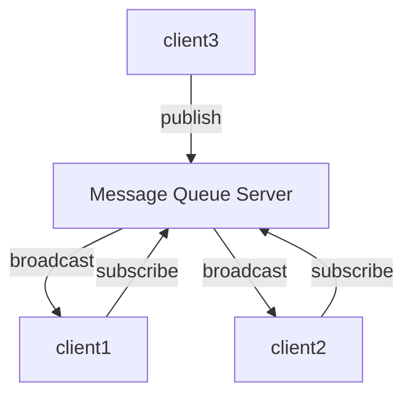

```mermaid
graph TD
    A[Message Queue Server]
    C1[client1] --> |subscribe| A
    C2[client2] --> |subscribe| A
    C3[client3] --> |publish| A
    A --> |broadcast| C1
    A --> |broadcast| C2
```