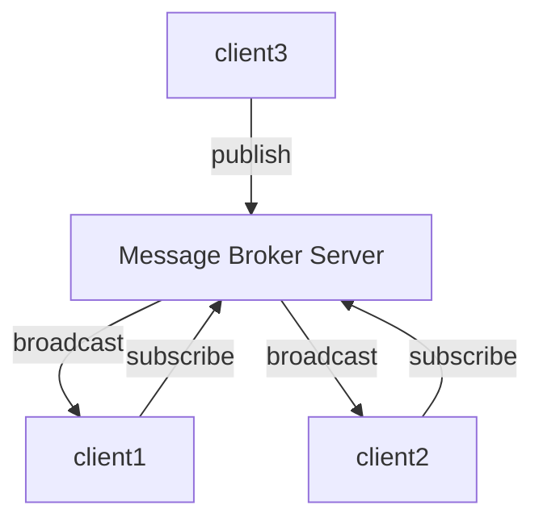

# Golang Coding Interview

- IM Dept. Backend Engineer
- 45 mins

## Description



根據上圖實現出對應的 `Message Broker Server` 與 `Client` 模組，使任意 client 能夠透過 server 廣播消息給其他 clients

## File Structure

```text
Interview/
 ├─ doc/              # 說明文件
 |   └─ image/        # 圖片資源
 ├─ pkg/              # 共用模組
 |   ├─ client/       # Client 模組
 |   ├─ flow/         # 訊息封包模組
 |   └─ server/       # Server 模組
 └─ main.go           # 程式進入點
```